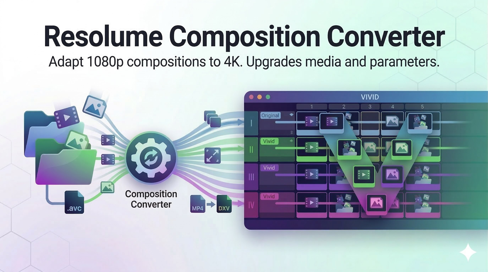
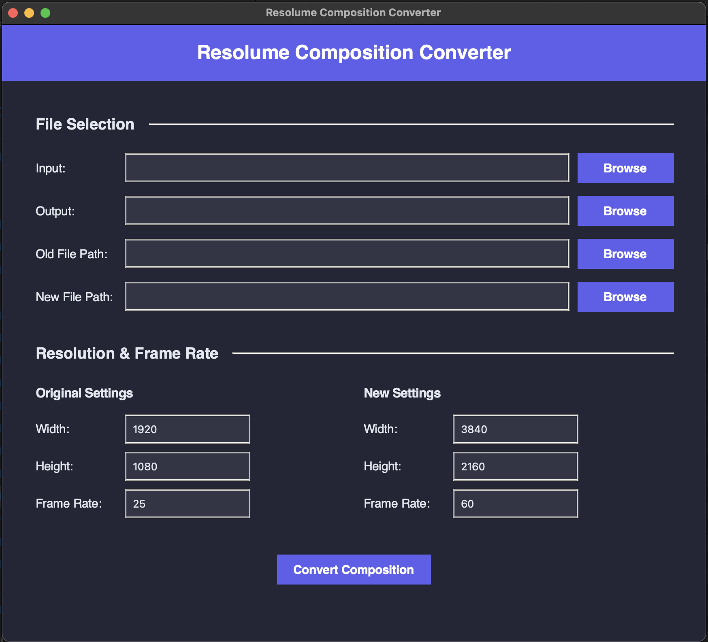

# Resolume Composition Converter
[](LICENSE)
[](https://github.com/tijnisfijn/Resolume-Composition-Converter/actions/workflows/ci.yml)
[](https://github.com/tijnisfijn/Resolume-Composition-Converter/actions/workflows/release-installers.yml)

A desktop tool that converts Resolume Arena composition files (`.avc`) between resolutions and frame rates, including media path replacement and format switching (for example `.mp4` to `.mov`/`.dxv` with matching base filename).



## A Note From The Maker

I built this as a free tool for the Resolume community. It is vibe-coded and tested, and should be safe to use. But like any tool that modifies Arena compositions, always back up your `.avc` first and test in your own setup before show use. Some edge cases can still slip through.

If you find bugs, issues, or have feature requests, please open an issue:
- [Open an issue](https://github.com/tijnisfijn/Resolume-Composition-Converter/issues)

## Download

Get the latest release:
- [Latest Release](https://github.com/tijnisfijn/Resolume-Composition-Converter/releases/latest)

Platform status:

| Platform | Status |
| --- | --- |
| macOS | Available |
| Windows | Available |

Windows note:
- Prebuilt downloads are currently not code-signed.
- SmartScreen/AV may warn.
- Use `More info -> Run anyway` if you trust the release source.

macOS note:
- App is currently not notarized.
- Gatekeeper may block first launch.
- Right-click app -> `Open` -> `Open` once.

Prefer to avoid platform trust warnings:
- Build from source yourself (instructions below). Local builds generally avoid these warnings.

## Install (Quick)

### Windows

1. Download `Resolume-Composition-Converter-Setup.exe` from the latest release.
2. Run installer and complete setup.
3. Launch from Start menu or desktop shortcut.

Alternative:
1. Download `Resolume Composition Converter Windows.zip`.
2. Extract and run `Resolume Composition Converter.exe`.

### macOS

1. Download `Resolume-Composition-Converter-macOS.dmg`.
2. Open DMG, drag app to Applications.
3. First launch: right-click app -> `Open` -> `Open`.

Alternative:
1. Download `Resolume Composition Converter Mac.zip`.
2. Extract and move app bundle to Applications.

For full install details, see [Install Guide](docs/INSTALL.md).

## Features

- Resolution conversion for composition/clip/layer/group transforms.
- Frame-rate conversion while preserving beats-based timing.
- Media path rebasing from old root to new root.
- Optional extension-agnostic media replacement (`same_basename.mp4 -> same_basename.mov`).
- Text and generator parameter scaling.
- Persistent effect position policy for unknown pixel-like effects.

UI preview:



## Usage

1. Open app.
2. Select input `.avc`.
3. Choose output file.
4. Set original and target resolution/fps.
5. Optional: provide old/new media roots.
6. Optional: enable `Ignore file extensions`.
7. Click `Convert Composition`.

Manual:
- Markdown: [docs/MANUAL.md](docs/MANUAL.md)
- HTML: [documentation/MANUAL.html](documentation/MANUAL.html)

## Build From Source

Prerequisites:
- Python 3.10+
- `pip`
- `git`

If this is your first time building from source, use AI as a guide:
1. Open ChatGPT/Claude/Copilot.
2. Paste this prompt:

```text
I’m on [Windows/macOS]. Walk me step by step to build and run this repo:
https://github.com/tijnisfijn/Resolume-Composition-Converter

Assume I am not technical. Give me one command at a time, wait for my result,
then give the next command. If a command fails, troubleshoot before continuing.
```

3. Run each command one by one.
4. Ask the AI: `Where is the built app located on disk?`

### macOS

```bash
git clone https://github.com/tijnisfijn/Resolume-Composition-Converter.git
cd Resolume-Composition-Converter
python3 -m venv .venv
source .venv/bin/activate
python -m pip install --upgrade pip
pip install -r requirements.txt
python build/mac/build_mac.py
bash scripts/create_macos_dmg.sh
```

Expected output:
- `dist/mac/Resolume Composition Converter Mac.zip`
- `dist/mac/Resolume-Composition-Converter-macOS.dmg`

### Windows

```powershell
git clone https://github.com/tijnisfijn/Resolume-Composition-Converter.git
cd Resolume-Composition-Converter
python -m venv .venv
.venv\Scripts\Activate.ps1
python -m pip install --upgrade pip
pip install -r requirements.txt
python build/windows/build_windows.py
```

Expected output:
- `dist/windows/Resolume Composition Converter Windows.zip`
- `dist/windows/Resolume Composition Converter\Resolume Composition Converter.exe`

Common first-time issues:
- `python` not found:
  - Install Python, then reopen terminal.
- PowerShell blocks activate script:
  - Run: `Set-ExecutionPolicy -Scope Process -ExecutionPolicy Bypass`
- Build fails midway:
  - Re-run `pip install -r requirements.txt`, then retry build.

## CI/CD

- CI workflow ([.github/workflows/ci.yml](.github/workflows/ci.yml)):
  - Runs tests on `windows-latest` and `macos-latest` for pushes/PRs.
- Release workflow ([.github/workflows/release-installers.yml](.github/workflows/release-installers.yml)):
  - Trigger: tag push (`v*`) or manual dispatch.
  - Builds:
    - Windows portable ZIP + installer `.exe`
    - macOS ZIP + `.dmg`
  - Publishes artifacts to GitHub Releases on tag builds.

## Contributing

1. Open an issue to discuss bug/feature.
2. Fork and branch.
3. Add tests for behavior changes.
4. Open a PR.

## License

MIT. See [LICENSE](LICENSE).
