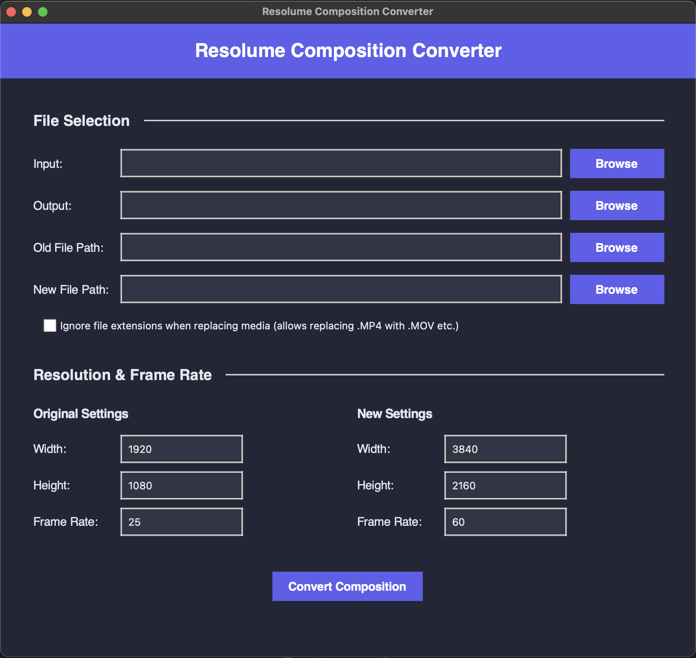

# Resolume Composition Converter

[](https://opensource.org/licenses/MIT)
[](https://www.apple.com/macos)

A desktop application for converting Resolume Arena composition files (.avc) between different resolutions and frame rates. Automatically adjusts all parameters while preserving timing and composition names.



## Open Source Project

This is an open-source project created by a single developer. Contributions, improvements, and feedback from the community are welcome and encouraged! If you'd like to contribute, please check out the [Future Roadmap](https://github.com/tijnisfijn/Resolume-Composition-Converter/wiki/Future-Roadmap) or the [Issues](https://github.com/tijnisfijn/Resolume-Composition-Converter/issues) page.

## Disclaimer

**Use at your own risk.** While this software has been tested, it is not regularly tested on all possible configurations and scenarios. Always make a backup of your composition files before using this converter. The author is not responsible for any data loss or damage that may occur from using this software.

## Features

- Convert Resolume Arena compositions between different resolutions
- Adjust frame rates while preserving timing
- Maintain composition names and structure
- Support for various media types (videos and images)
- Replace media files with different formats (e.g., .MP4 with .MOV)
- Preserve aspect ratio for different image formats (.jpg, .jpeg, .png, .gif, .bmp, .tiff, .webp)
- Simple and intuitive user interface with drag-and-drop support

## Repository Structure

- `/` - Core application files
- `/build/mac/` - Mac-specific build files
- `/build/windows/` - Windows-specific build files
- `/dist/mac/` - Output directory for Mac builds
- `/dist/windows/` - Output directory for Windows builds
- `/screenshots/` - Application screenshots
- `/icons/` - Application icons
- `/documentation/` - Generated documentation

## Installation

### macOS

1. Download the latest release from the [Releases page](https://github.com/tijnisfijn/Resolume-Composition-Converter/releases)
2. Extract the ZIP file
3. Drag the `Resolume Composition Converter.app` to your Applications folder

### Windows

Windows users need to build the application from source:

1. Download the source code from the [Releases page](https://github.com/tijnisfijn/Resolume-Composition-Converter/releases)
2. Follow the instructions in `build/windows/PC_BUILD_INSTRUCTIONS.md`

## Usage

1. Launch the application
2. Select your input composition file (.avc)
3. Choose an output location for the converted file
4. Set your desired resolution and frame rate
5. Optionally, provide paths to your old and new media files if you want to update file references
6. Check "Ignore file extensions" if you want to replace media files with different formats (e.g., .MP4 with .MOV)
7. Click "Convert Composition"

For more detailed instructions, please refer to the [User Manual](MANUAL.md).

## Building from Source

### Prerequisites

- Python 3.8 or newer
- pip (Python package installer)

### macOS

```bash
# Clone the repository
git clone https://github.com/tijnisfijn/Resolume-Composition-Converter.git
cd Resolume-Composition-Converter

# Create and activate a virtual environment
python -m venv venv
source venv/bin/activate

# Install dependencies
pip install -r requirements.txt

# Build the application
python build/mac/build_mac.py
```

### Windows

```bash
# Clone the repository
git clone https://github.com/tijnisfijn/Resolume-Composition-Converter.git
cd Resolume-Composition-Converter

# Create and activate a virtual environment
python -m venv venv
venv\Scripts\activate

# Install dependencies
pip install -r requirements.txt

# Build the application
python build/windows/build_windows.py
```

## Support

For help and support, please [open an issue](https://github.com/tijnisfijn/Resolume-Composition-Converter/issues) on our GitHub repository.

## Contributing

Contributions are welcome! Whether you're a developer, designer, or user with ideas, there are many ways to help improve this project:

1. Check the [Issues](https://github.com/tijnisfijn/Resolume-Composition-Converter/issues) page
2. Open a new issue to discuss your idea
3. Fork the repository and submit a pull request

See the [Future Roadmap](https://github.com/tijnisfijn/Resolume-Composition-Converter/wiki/Future-Roadmap) for ideas on potential features that could be implemented.

## License

This project is licensed under the MIT License - see the [LICENSE](LICENSE) file for details.